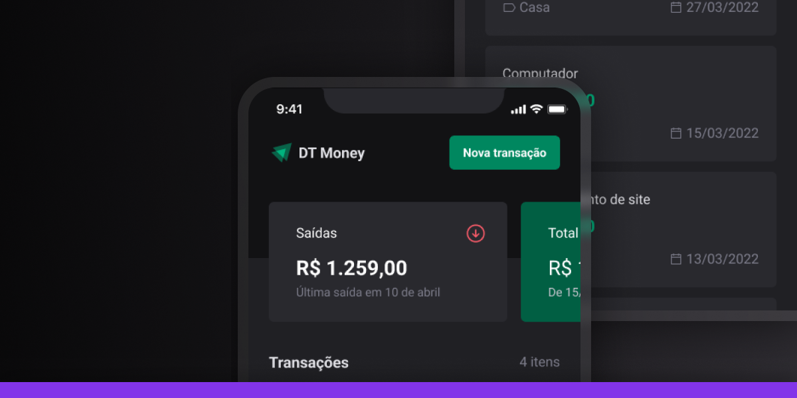

# DT Money - (👨‍💻🚧 In development)

A learning project focused on personal finance management using React Native and Expo.



## About the Project

**DT Money** is a mobile application for managing financial transactions, allowing users to track incomes, expenses, and total balance.

## Features

- Register new transactions (income and expenses)
- List all transactions
- View updated balance
- Modern and responsive interface

## Technologies Used

- [React Native](https://reactnative.dev/)
- [Expo](https://expo.dev/)
- [TypeScript](https://www.typescriptlang.org/)
- [NativeWind (Tailwind CSS for React Native)](https://www.nativewind.dev/)

## How to Run

1. **Clone the repository**
    ```sh
    git clone https://github.com/your-username/dt-money-app.git
    cd dt-money-app
    ```

2. **Install dependencies**
    ```sh
    npm install
    # or
    yarn
    ```

3. **Start the project**
    ```sh
    npx expo start
    ```

  4. **Start the project**
  - Use the Expo Go app to scan the QR Code shown in the terminal or browser.

  ---

## 👤 Author

Made with ♥ by Marcelo Galdino :wave: [Get in touch!](https://www.linkedin.com/in/marcelogaldino/)


## 📝 License

This project is distributed under the MIT license.